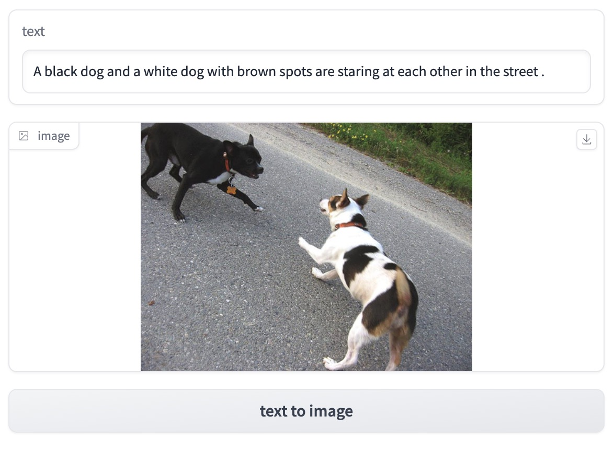

# mini-CLIP

模型地址：[百度网盘](https://pan.baidu.com/s/1v5qkntXY0GKgjzRk5H5pHw?pwd=6cc3) 提取码: 6cc3 

样例：  
注意：这个项目只用于学习CLIP，只在小规模数据集上进行训练，没有设置验证集与测试集。模型对于训练集外的语料和图片表现很差。

## Train
  - step1 下载Flickr8k数据集，解压图片包和label。数据集地址：https://github.com/goodwillyoga/Flickr8k_dataset
  - step2 pip install -r requirements.txt
  - step3 修改config.yaml中的data_path为解压后数据集的根目录，里面需包含`Flicker8k_Dataset`文件夹与`Flickr8k.token.txt`
  - step4 python main.py，使用一张RTX TITAN 24G训练4-5小时可以收敛。

## Demo
  - 一个使用CLIP完成text2image retrieval任务的样例。
  - step1 修改`extract_img_feats.py`中图片的地址，执行`python extract_img_feats.py`提取图片特征。
  - step2 python demo.py
  - 或者可以直接执行`python test_model.py`计算指定图片与文本的相似度。

